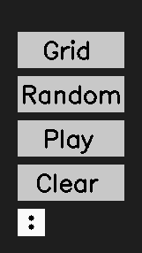
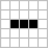

# Conway's Game of Life

The Game of Life, also known simply as Life, is a cellular automaton devised by the British mathematician John Horton Conway in 1970. It is a zero-player game, meaning that its evolution is determined by its initial state, requiring no further input. One interacts with the Game of Life by creating an initial configuration and observing how it evolves. It is Turing complete and can simulate a universal constructor or any other Turing machine.

## Rules
The universe of the Game of Life is an infinite, two-dimensional orthogonal grid of square cells, each of which is in one of two possible states, live or dead (or populated and unpopulated, respectively). Every cell interacts with its eight neighbours, which are the cells that are horizontally, vertically, or diagonally adjacent. At each step in time, the following transitions occur:

- Any live cell with fewer than two live neighbours dies, as if by underpopulation.
- Any live cell with two or three live neighbours lives on to the next generation.
- Any live cell with more than three live neighbours dies, as if by overpopulation.
- Any dead cell with exactly three live neighbours becomes a live cell, as if by reproduction.

These rules, which compare the behavior of the automaton to real life, can be condensed into the following:

- Any live cell with two or three live neighbours survives.
- Any dead cell with three live neighbours becomes a live cell.
- All other live cells die in the next generation. Similarly, all other dead cells stay dead.

The initial pattern constitutes the seed of the system. The first generation is created by applying the above rules simultaneously to every cell in the seed, live or dead; births and deaths occur simultaneously, and the discrete moment at which this happens is sometimes called a tick.[nb 1] Each generation is a pure function of the preceding one. The rules continue to be applied repeatedly to create further generations.

## Getting Started

- Simply clone the Game-of-Life repo in your local machine. Run the ```main.py``` file using any standard python interpreter. In case of any errors or compatibility issues, submit an issue in this git.
- Remember you must have openCV and numpy installed on your PC. If not paste the below commands in your terminal and let all the files to download.
    - ```pip install opencv-python```
    - ```pip install numpy```



- The program is designed with interactable menu. You may click on the 3 dots icon to get a list of available options.

    - ```Grid```: Switches the grid mode ON/OFF.

    

    - ```Random```: Get a randomly generated colony of alive cells.

    

    - ```Play```: Starts the simulation of game of life.
    - ```Pause```: Pauses the simulation.
    - ```Clear```: Clears the alive cells and you get a fresh new screen.
- You may click on the screen to manually make a cell alive. Selecting an alive cell will make it dead.
    **Note**: The manual clicking only works when the menu is minimized.
- Press ```q``` to Quit.

## Sample Example

Try this one and see how it evolves into its next generation.


## Some notable patterns

- Still Lifes
    <figure>
        
        <figcaption>Block</figcaption>
    </figure>
    <figure>
        
        <figcaption>Beehive</figcaption>
    </figure>

- Oscillators
    <figure>
        
        <figcaption>Blinker (period 2)</figcaption>
    </figure>
    <figure>
        
        <figcaption>Pulsar (period 3)</figcaption>
    </figure>

- Spaceships
    <figure>
        
        <figcaption>Glider</figcaption>
    </figure>
    <figure>
        
        <figcaption>Light Weight Spaceship</figcaption>
    </figure>

## Tools Used

- Visual Studio Code
- python v3.9.7
- OpenCV-python v4.5.5
- Numpy v1.22.2